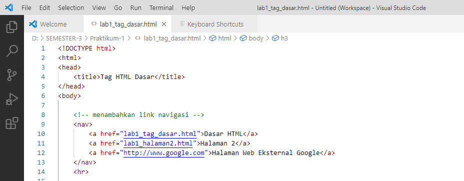

# PENGANTAR HTML
HTML (Hypertest Markup Language) merupakan bahasa markup yang digunakan untuk membuat sebuah halaman web dan menampilkan berbagai informasi didalam sebuah browser. HTML berupa kode-kode tag yang menginstruksikan browser untuk menghasilkan tampilan sesuai dengan yang diinginkan. HTML saat ini merupakan standar internet yang didefinisikan dan dikendalikan penggunaannya oleh World Wide Web Consortium (W3C)

HTML memilik struktur yang fleksibel, tanpa lojik serta toleran terhadap kesalahan, standar minimal dari dokumen HTML terdiri dari:

- Document Type Declaration (DTD)
- Document Header
- Document Body

# TAG DASAR HTML

1. Membuat file baru dengan nama Lab1_tag_dasar.html dan tambahkan tag dasar dokumen HTML

- Code HTML :

- Output :

2. Membuat Paragraf sederhana

- Code HTML :

- Output :

kemudian atur atribut setiap paragraf seperti berikut, amati perubahannya 

- Code HMTL :

- Output :

3. Menambahkan Judul

- Code HTML :

- Output :

4. Memformat Teks

- Code HTML :

- Output :

5. Menyisipkan Gambar

- Code HTML :

- Output :

6. Menambahkan Hyperlink

- Code HTML :

- Output :

# PERTANYAAN 

1. lakukan perubahan kode sesuai dengan keinginan anda, amati perubahan nya, adakah error ketika terjadi kesalahan penulisan tag?

    = tidak akan ada eror, tetapi tag yang diketik tidak akan muncul di website yang sudah dibuat

2. apa perbedaan dari tag p dan tag br? berikan penjelasan nya !
    = Tag p biasanya digunakan untuk menampilkan teks berurutan yang membentuk paragraf, sedangkan Tag br digunakan untuk membuat jeda baris baru (line break) di dalam teks atau konten

3. apa perbedaan atribut title dan alt pada tag img? berikan penjelasanya !

    = Atribut alt digunakan untuk memberikan teks alternatif yang menjelaskan gambar kepada pengguna ketika gambar tidak dapat ditampilkan, atau untuk membantu pembaca layar (screen reader) dalam memahami konten gambar. Sedangkan Atribut title digunakan untuk memberikan informasi tambahan dalam bentuk tooltip ketika pengguna mengarahkan kursor mouse ke gambar.

4. untuk mengatur ukuran gambar, digunakan atribut width dan height. agar tampilan gambar proporsional sebaiknya kedua atribut tersebut diisi semua atau tidak? berikan penjelesan nya ! 

    = ya, diisi semua. idealnya, anda seharusnya mengisi baik atribut width maupun height ketika ingin mengatur ukuran gambar. hal ini akan memastikan bahwa gambar tetap proporsional dan tidak terdistorsi.

5. pada link tambahkan atribut target dengan nilai atribut bervariasi (_blank, _self,_top,_parent), apa yang akan terjadi pada masing-masing nilai atribut tersebut?

    - _blank : Ketika Anda menggunakan target="_blank", tautan tersebut akan membuka halaman atau dokumen yang terkait dalam jendela atau tab baru, terpisah dari jendela/tab saat ini.

    - _self : Ketika digunakan, tautan akan membuka halaman atau dokumen yang terkait di jendela/tab yang sama di mana tautan tersebut berada. Ini adalah perilaku standar.

    - _top : Ketika Anda menggunakan target="_top", tautan akan membuka halaman atau dokumen yang terkait di jendela/tab teratas (paling atas) dalam tumpukan jendela/tab.

    - _parent : Ketika Anda menggunakan target="_parent", tautan akan membuka halaman atau dokumen yang terkait di jendela/tab yang berada satu tingkat di atas dalam hirarki iframe (jika ada).